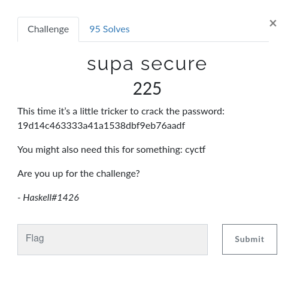

## Forensics

### Image Viewer


This is the basi3 challenge of forensics, given My friend took this image in a cool place but it nothing getting from that so this is the forensics chall our first step is to see the strings. So i run the [strings](https://linux.die.net/man/1/strings) cmd on this file. ```strings shoob_2.jpeg | grep CYCTF``` i got the flag. The  flag is `CYCTF{h3h3h3_1m@g3_M3t@d@t@_v13w3r_ICU}`

### The row beneath


In this challenge actually the hints is given We intercepted a super secret plan. Can you find anything inside of it? so it saying some file is hidden inside that. i downloaded that file when i click to open it is giving error so i check the file `file plan.png`  image extensions given is png but that is jpeg so i converted to jpeg `mv plan.png plan.jpeg` so first i check strings `strings plan.jpeg` and i got the flag `CYCTF{L00k_1n_th3_h3x_13h54d56}` 

### What’s the password?


Given hints in challenge My friend gave me this file, he said there was something hidden. So I downloaded that file. After running strings, exiftool, foremost nothings got so i after that i used steghide cmd without any passphrase nothings got after that i used the sudo as a passphrase beacuse that is the file name `steghide extract -sf sudo.jpg -p sudo` and finally i got the steganopayload457819.txt file i use cat cmd cat steganopayload457819.txt  and got the flag

### Steg 2 


This is the 300 points chall, using tools stegsolve will get thne flag `CYCTF{l$b_st3g@n0gr@phy_fOr_th3_w1n}`

### Steg Ultimate 


This chall is of 450 points, and this is little bit tricky about 100 teams solved this challenge. so first i used tools strings, exiftool i got nothings then i used `steghide extract -sf stegultimate.jpg` without passphrase i got steganopayload473955.txt file in that there is pastebin url https://pastebin.com/raw/YnKqT9s3 then i browse that url i got some giberish things i copied all the things and pasted in cyberchef then i used base64 -> render image i got the flag.


## Cryptography

### Beware the Ides of March


Given the cipher JFJAM{j@3$@y_j!wo3y} copy and paste in cyberchef and use rot19. got the flag CYCTF{c@3$@r_c!ph3r}

### Home Base


Given cipher 4a5a57474934325a47464b54475632464f4259474336534a4f564647595653574a354345533454434b52585336564a524f425556435533554e4251574f504a35 this looks like base and also given chall name as a home base so i tried decode

hex -> base32 -> base64 -> base85 finally got the flag `CYCTF{it5_@_H0m3_2un!}` 


### Sus


This chall is of 200 points this is the cipher ooflgqofllcedopwvtnhyacwllhehdl in this chall hints is also given We ordered some salad as well, and we made sure to have it drizzled with some vinegar. So by seeing the hints that this is the vigenere cipher so i decoded from cyberchef with the key `salad` and got the flag wouldyoulikesomevinegarwiththat


## Reverse Engineering

###  Password 1 


In this challenge the flag is given in array form and matching so wrap all the strings based on index. 

### Password 2 


In this challenge getting input from user and checking that input given is eqaul to 47 por not and the flag is of 47 it is given in python script.
```if(len(password) != 47):
      return False
    newPass = list(password)
    for i in range(0,9):
      newPass[i] = password[i]
    for i in range(9,24):
      newPass[i] = password[32-i]
    for i in range(24,47,2):
      newPass[i] = password[70-i]
    for i in range(45,25,-2):
      newPass[i] = password[i]
    password = "".join(newPass);
    return password == "CYCTF{ju$@rcs_3l771l_@_t}bd3cfdr0y_u0t__03_0l3m"
```
 So basically what it is doing it running the 4 for loop. 1st loop running from index 0 to 8 and it storing the simply every character into newPass var. 2nd loop running from 9 to 24 and in this loop subtracting the evry index number from the 32 and storing the value of the index into newPass variable. 3rd loop running from 24 to 46 moving forward every 2 index and subtracting the index from 70 at last loop is running from 47 to 25 with 2 index back actually this loop is running from backward and it doings nothing simply assigning the character of the index into newPass. So simply i write this script i got the flag
 ```
 #!/usr/bin/python3

 strings="CYCTF{ju$@rcs_3l771l_@_t}bd3cfdr0y_u0t__03_0l3m"

 new_pass=list(strings)
 for i in range(0,9):
 	new_pass[i]=strings[i]
 	for i in range(9,24):
 	  new_pass[i] = strings[32-i]
 	for i in range(24,47,2):
 	  new_pass[i] = strings[70-i]
 	for i in range(45,25,-2):
 	  new_pass[i] = strings[i]	
 print("".join(new_pass)) 
 ```

## Web Exploitation

### Look Closely


THis is the basic chall of web ctf category. by seeing the source code got the flag CYCTF{1nSp3t_eL3M3nt?}

### Disallow


This is of 100 points chall of web category.

by seeing the /robots.txt file one file got with name Disallow: /n0r0b0tsh3r3/flag.html


so i visited and got the flag `CYCTF{d33r0b0t$_r_sUp3r10r}`

### Data Store 


This is of 175 points chall.

in this chall login page is given so i tried admin'-- and got the flag `CYCTF{1_l0v3_$q1i}`


## Password Cracking

### secure (i think?)


This is of password cracking category. Given hash is b0439fae31f8cbba6294af86234d5a28. Simply copy-paste in [crackstation](https://crackstation.net/)

got the flag `securepassword`

### Crack the Zip! 


In this challenge given the encrypted zip file with password so to crack i used fcrackzip tool and get the password 


### supa secure 



This is of 225 points chall given hash is 19d14c463333a41a1538dbf9eb76aadf this is md5 hash i used https://www.md5online.org/md5-decrypt.html to crack and got the password ilovesalt and that is the flag.

### Me, Myself, and I 


THis is of 225 points chall given hash is 2412f72f0f0213c98c1f9f6065728da4529000e5c3a2e16c4e1379bd3e13ccf543201eec4eb7b400eb5a6c9b774bf0c0eeda44869e08f3a54a0b13109a7644aa i used [crackstation](https://crackstation.net/)

and the flag is `whoami`

## Welcome


this is the very very basic chall of this ctf the hints is given join discord and run the flag cmd and the flag is inside the bot channel i joined and run the cmd ?flag i got the flag `CYCTF{W3lc0m3_t0_Cyb3rY0ddh@_CTF_2020!}`

YouTube [@Oblivion](https://www.youtube.com/c/Oblivion5237)
CTFTime [@0b1ivi0n](https://ctftime.org/team/127567)
